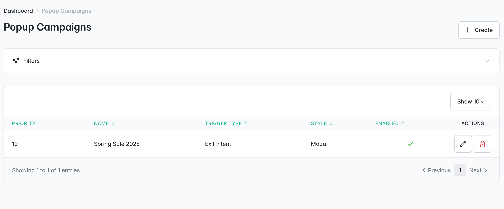
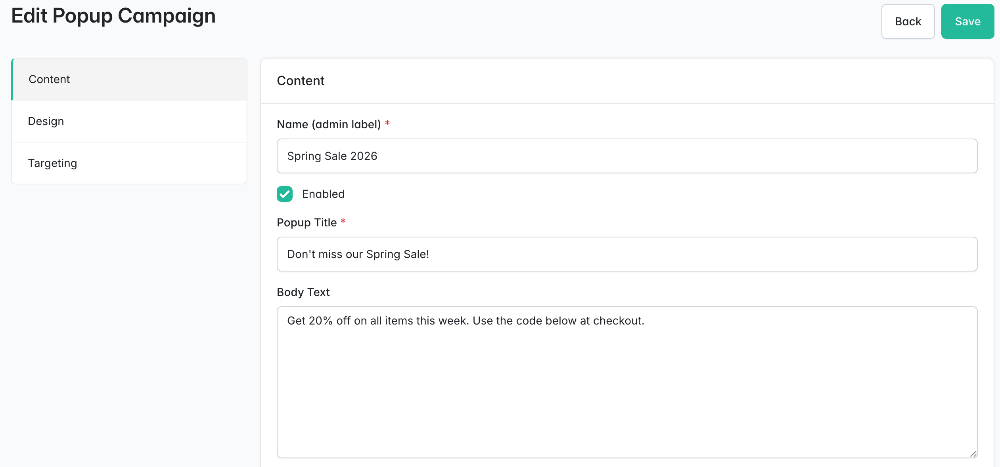
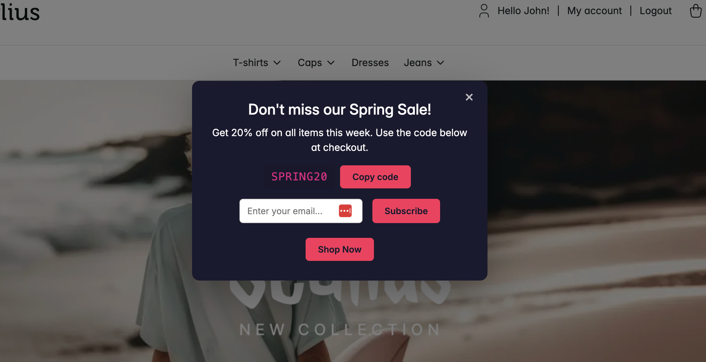

<p align="center">
    <a href="https://sylius.com" target="_blank">
        <picture>
            <source media="(prefers-color-scheme: dark)" srcset="https://media.sylius.com/sylius-logo-800-dark.png">
            <source media="(prefers-color-scheme: light)" srcset="https://media.sylius.com/sylius-logo-800.png">
            
        </picture>
    </a>
</p>

<h1 align="center">Sylius Popup Plugin</h1>

<p align="center">
    Exit-intent & engagement popup system for <a href="https://sylius.com">Sylius 2.x</a> stores, fully managed from the admin panel.
</p>

<p align="center">
    <a href="https://github.com/abderrahimghazali/sylius-popup-plugin/actions/workflows/ci.yaml"></a>
    <a href="https://packagist.org/packages/abderrahimghazali/sylius-popup-plugin"></a>
    <a href="https://packagist.org/packages/abderrahimghazali/sylius-popup-plugin"></a>
    <a href="LICENSE"></a>
    <a href="https://packagist.org/packages/abderrahimghazali/sylius-popup-plugin"></a>
    <a href="https://packagist.org/packages/abderrahimghazali/sylius-popup-plugin"></a>
</p>

---

## Screenshots

### Admin — Campaign List


### Admin — Edit Campaign (Tabbed Form)


### Shop — Modal Popup (Exit Intent)


## Features

- **Multiple popup campaigns** — create, enable/disable, and prioritize from the admin panel
- **4 trigger types:**
  - Exit intent (mouseleave detection)
  - Time on page (configurable delay in seconds)
  - Scroll depth (configurable percentage)
  - Cart abandonment (exit intent only when cart has items)
- **Smart frequency control** — show once per session, per 24h, or per 7 days (localStorage)
- **Page targeting** — all pages, product pages, cart, or checkout
- **Audience targeting** — everyone, guests only, or logged-in users only
- **2 popup styles** — centered modal with overlay, or fixed bottom bar
- **Discount codes** — display a copyable code with one-click copy (Clipboard API)
- **Email capture** — optional email field that POSTs to a dedicated API endpoint and dispatches a `sylius_popup.email_captured` event for 3rd-party integrations
- **Full design control** — background color, text color, button color (HTML color picker in admin)
- **Rate-limited API** — email subscribe endpoint limited to 3 requests/IP/hour
- **No external JS** — pure vanilla JS via Stimulus controller
- **Twig hooks** — auto-injects into the shop layout, no template overrides needed

## Requirements

- Sylius 2.1+
- Symfony 7.0+
- PHP 8.2+

## Installation

1. Require the plugin:

```bash
composer require abderrahimghazali/sylius-popup-plugin
```

2. Register the bundle in `config/bundles.php` (if not auto-discovered):

```php
return [
    // ...
    Abderrahim\SyliusPopupPlugin\SyliusPopupPlugin::class => ['all' => true],
];
```

3. Import routes — create `config/routes/sylius_popup.yaml`:

```yaml
sylius_popup:
    resource: '@SyliusPopupPlugin/config/routes.yaml'
```

4. Generate and run the migration:

```bash
bin/console doctrine:migrations:diff
bin/console doctrine:migrations:migrate
```

5. Register the Stimulus controller in `assets/shop/controllers.json`:

```json
{
    "controllers": {
        "@abderrahimghazali/sylius-popup-plugin": {
            "popup": {
                "enabled": true,
                "fetch": "eager"
            }
        }
    }
}
```

6. Symlink the plugin assets and rebuild:

```bash
# Create the symlink (from your project root)
mkdir -p node_modules/@abderrahimghazali
ln -s ../../vendor/abderrahimghazali/sylius-popup-plugin/assets node_modules/@abderrahimghazali/sylius-popup-plugin

# Rebuild assets
yarn encore dev
```

## Usage

### Admin Panel

Navigate to **Marketing > Popup Campaigns** in the Sylius admin sidebar.

Create a new campaign with three configuration tabs:

| Tab | Fields |
|-----|--------|
| **Content** | Name, title, body text, CTA button label & URL, discount code, email capture toggle |
| **Design** | Style (modal/bar), background color, text color, button color |
| **Targeting** | Trigger type & params, show frequency, target pages, target audience, priority |

Toggle campaigns on/off directly from the grid.

### Trigger Types

| Trigger | Behavior | Config |
|---------|----------|--------|
| Exit Intent | Fires when cursor leaves viewport (top edge) | — |
| Time on Page | Fires after N seconds | `triggerDelay` |
| Scroll Depth | Fires after X% page scroll | `triggerScrollDepth` |
| Cart Abandonment | Exit intent, but only when cart has items | — |

### Email Capture Event

When a visitor submits their email, the plugin dispatches:

```
Event: sylius_popup.email_captured
Payload: { email, popupId }
```

Listen to this event to integrate with Mailchimp, Sendinblue, or any email service:

```php
use Symfony\Component\EventDispatcher\Attribute\AsEventListener;
use Symfony\Component\EventDispatcher\GenericEvent;

#[AsEventListener(event: 'sylius_popup.email_captured')]
final class EmailCapturedListener
{
    public function __invoke(GenericEvent $event): void
    {
        $email = $event->getArgument('email');
        $popupId = $event->getArgument('popupId');

        // Send to your email marketing platform
    }
}
```

### API Endpoint

```
POST /api/v2/shop/popup/{id}/subscribe
Content-Type: application/json

{ "email": "visitor@example.com" }

→ 200 { "success": true }
→ 400 { "error": "Invalid email address." }
→ 429 { "error": "Too many requests. Please try again later." }
```

Rate limited to 3 requests per IP per hour.

## Entity: PopupCampaign

| Field | Type | Description |
|-------|------|-------------|
| `name` | string | Admin label (not shown to visitors) |
| `enabled` | boolean | Active/inactive toggle |
| `title` | string | Popup heading |
| `body` | text | Popup body content |
| `ctaLabel` | string? | CTA button text |
| `ctaUrl` | string? | CTA button link |
| `discountCode` | string? | Copyable discount code |
| `emailCaptureEnabled` | boolean | Show email input field |
| `style` | enum | `modal` or `bar` |
| `backgroundColor` | string | Hex color (default `#ffffff`) |
| `textColor` | string | Hex color (default `#111111`) |
| `buttonColor` | string | Hex color (default `#000000`) |
| `triggerType` | enum | `exit_intent`, `time_on_page`, `scroll_depth`, `cart_abandonment` |
| `triggerDelay` | int | Seconds (for time_on_page) |
| `triggerScrollDepth` | int | Percentage (for scroll_depth) |
| `showFrequency` | enum | `session`, `day`, `week` |
| `targetPages` | enum | `all`, `product`, `cart`, `checkout` |
| `targetAudience` | enum | `everyone`, `guests`, `logged_in` |
| `priority` | int | Higher = shown first |

## Architecture

```
src/
├── Controller/
│   ├── Admin/PopupCampaignController.php    # CRUD + AJAX toggle
│   └── Shop/PopupSubscribeController.php    # Email capture API
├── DependencyInjection/
│   ├── Configuration.php
│   └── SyliusPopupExtension.php             # Prepends resources, grids, hooks
├── Entity/
│   ├── PopupCampaign.php
│   └── PopupCampaignInterface.php
├── Enum/                                     # 5 backed string enums
├── EventListener/AdminMenuListener.php       # Marketing menu item
├── Form/Type/PopupCampaignType.php          # Admin form with all fields
├── Repository/PopupCampaignRepository.php    # Targeting query
├── Service/PopupRenderer.php                 # Page/audience resolution
├── Twig/PopupRendererExtension.php          # Twig function bridge
└── SyliusPopupPlugin.php                    # Bundle class

assets/controllers/popup-controller.js        # Stimulus controller
templates/
├── admin/popup_campaign/                     # Tabbed create/update forms
└── shop/                                     # Modal + bar + renderer
```

## Testing

```bash
vendor/bin/phpunit
```

## License

MIT. See [LICENSE](LICENSE).
